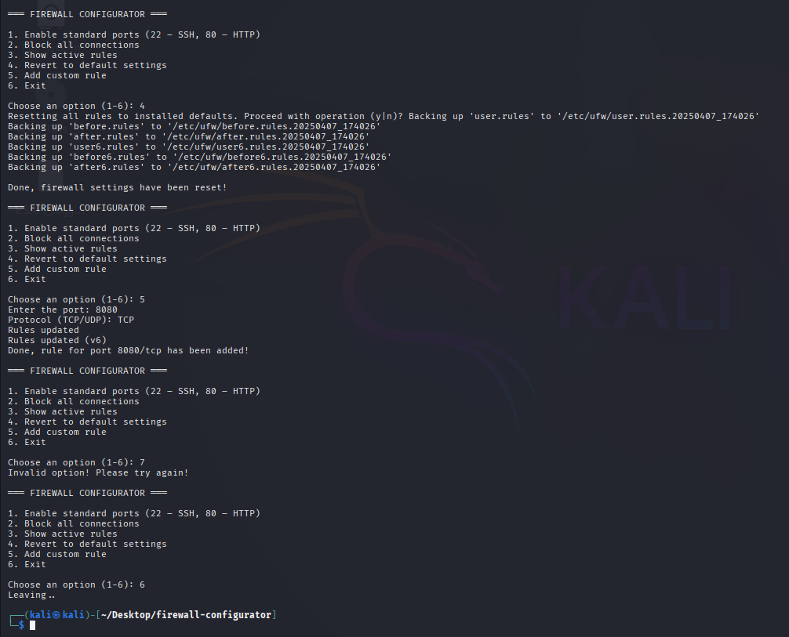
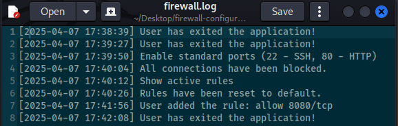

Firewall Configurator (UFW CLI Menu Tool)

A simple but powerful Python-based CLI utility to configure the UFW (Uncomplicated Firewall) on Linux systems.

1. Features

- Enable standard ports: 22 (SSH) and 80 (HTTP)
- Block all incoming connections (default deny)
- Display currently active firewall rules
- Revert to default UFW settings
- Add custom rule for any TCP/UDP port
- Logs all actions in `firewall.log`

2. Requirements

- Python 3
- UFW installed and enabled
- Linux system with sudo access

3. Usage

- Make script executable:	chmod +x firewall.py
- Run it:			./firewall.py

4. Screenshots

- CLI Demo 1
![Firewall CLI Demo] 1(./firewall_demo1.png)

- CLI Demo 2

- Logged Actions

